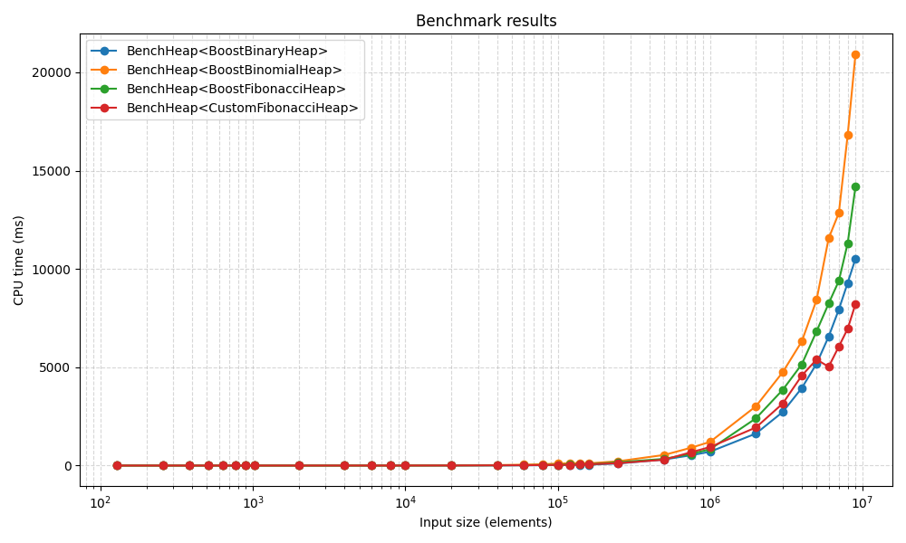

# Fibonacci Heap

## Описание

Фибоначчиева куча — структура данных для приоритетных операций с асимптотикой:

| Операция    | Сложность |
| ----------- | --------- |
| Insert      | O(1)      |
| GetMin      | O(1)      |
| ExtractMin  | O*(log N) |
| DecreaseKey | O*(1)     |
| Merge       | O(1)      |

Более подробно теория изложена в [pdf](СоложенкинСА_Б01-411_2025.pdf)

---

## API

```cpp
namespace fhp {

class FHeap {
public:
    class Handle {
    public:
        Handle();
    };

    FHeap();
    Handle Insert(int key);
    int GetMin() const;
    int ExtractMin();
    void DecreaseKey(const Handle& h, int new_key);
    void Erase(const Handle& h);
    void Merge(FHeap& other);
    size_t GetSize() const;
};

}  // namespace fhp
```

---

## Зависимости

- g++
- CMake
- GoogleTest
- GoogleBenchmark
- Boost

```bash
sudo apt-get install cmake g++ libgtest-dev libbenchmark-dev libboost-all-dev
```

- Python3 + пакеты `pandas`, `matplotlib`

```bash
sudo apt-get install python3-pandas python3-matplotlib
```

или

```bash
sudo apt-get install pip
pip install -r requirements.txt
```

либо, если Вы приличный человек

```bash
conda create --name fheap_benchmark python=3.11 -y --file requirements.txt
```

---

## Сборка и запуск

Сборка
```
./scripts/build.sh
```

Запуск юнит тестов
```
./scripts/test.sh
```

---

## Бенчмарки и визуализация

Соберите проект и запустите бенчмарки в JSON-формате:

```bash
./build/fheap_bench [artifacts_dir] [output_json]
```

Построить таблицу и график (все кучи на одном графике):

```bash
python3 make_table_and_plot.py [-h]
                               --input        INPUT
                               --artifacts    ARTIFACTS
                               --output-plot  OUTPUT_PLOT
                               --output-table OUTPUT_TABLE
```

`bench.csv` содержит сводную таблицу, `bench.png` — график времени (CPU) от размера задачи в логарифмической шкале по оси X.

## Результаты бенчмарков

Бенчмарк был проведен на машине со следующими параметрами

<table>
<tr>
  <td>Процессор</td>
  <td>AMD Ryzen 7 8845H</td>
</tr>
<tr>
  <td>ОС</td>
  <td>Linux Mint 22.1</td>
</tr>
<tr>
  <td>ОЗУ</td>
  <td>32 Гб</td>
</tr>
<tr>
  <td>Компилятор</td>
  <td>g++ -O3 13.3.0</td>
</tr>
</table>


